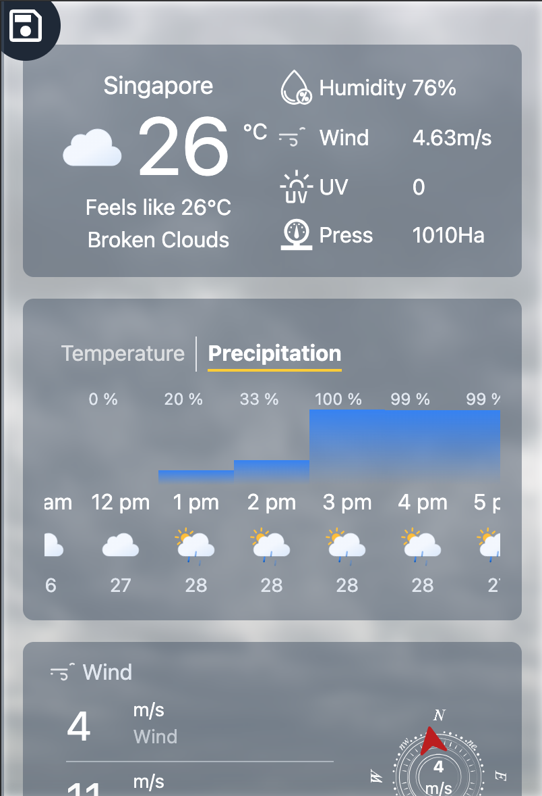
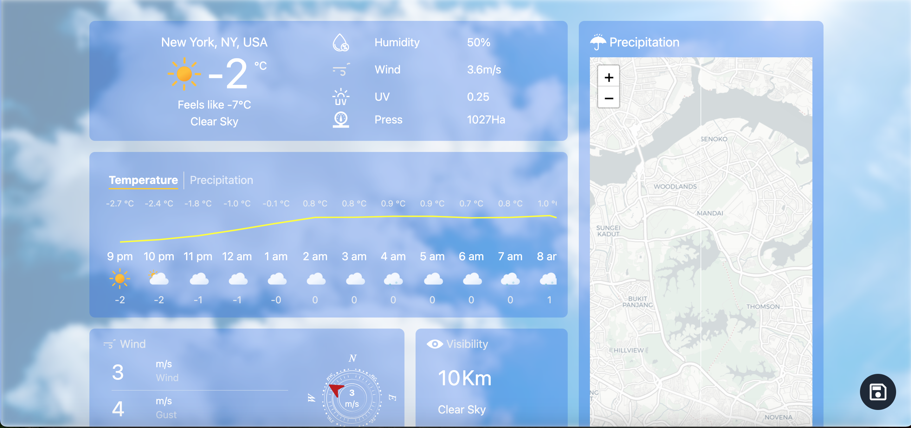
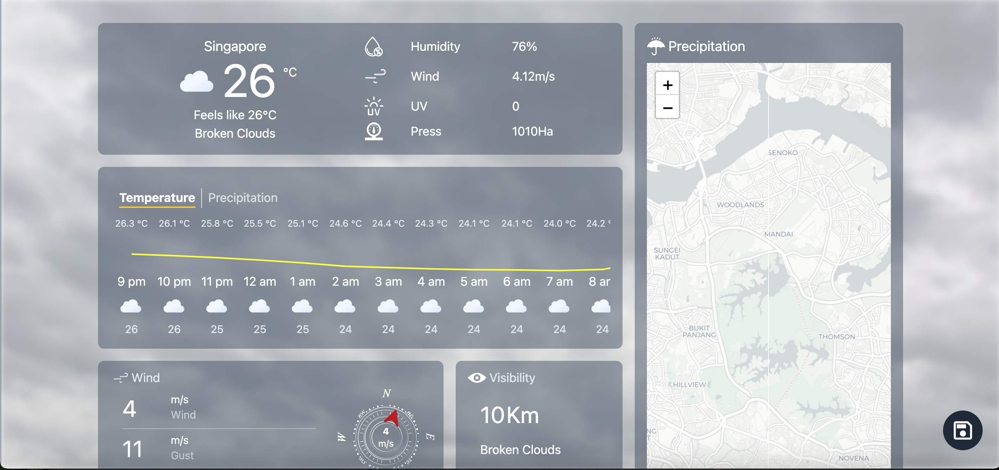
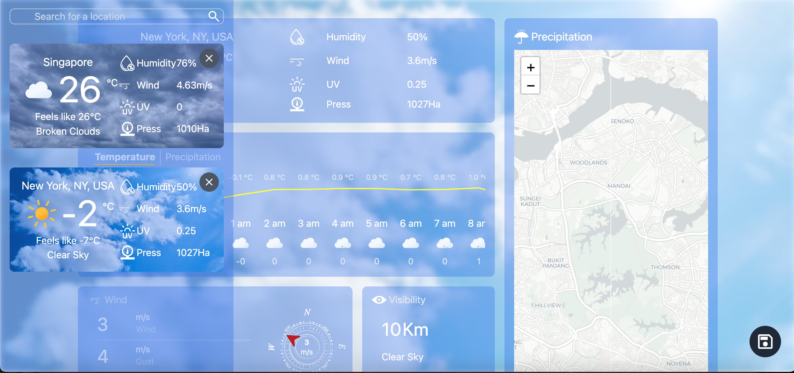
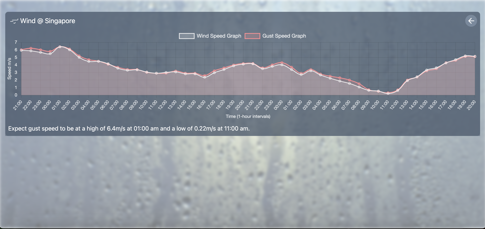

# Weather App

Weather application mockup is a simple application that allows users to view the weather of a location. The application is built using React and Node.js. The application uses the OpenWeatherMap API & Google Place API to fetch the weather data and location data.

## Mobile View

<p align="center">
  
</p>

## Desktop View

<p align="center">
  
  
</p>

<p align="center">
  
  
</p>

# Pre-requisites

- Docker
- Docker Compose
- Node.js
- pnpm

## Installation On Ubuntu

Setup is tested on Ubuntu 20.04

### Docker

Follow the instructions on the [official website](https://docs.docker.com/engine/install/ubuntu/)
Add Docker's official GPG key:

```bash
sudo apt-get update
sudo apt-get install ca-certificates curl
sudo install -m 0755 -d /etc/apt/keyrings
sudo curl -fsSL https://download.docker.com/linux/ubuntu/gpg -o /etc/apt/keyrings/docker.asc
sudo chmod a+r /etc/apt/keyrings/docker.asc

# Add the repository to Apt sources:
echo \
  "deb [arch=$(dpkg --print-architecture) signed-by=/etc/apt/keyrings/docker.asc] https://download.docker.com/linux/ubuntu \
  $(. /etc/os-release && echo "${UBUNTU_CODENAME:-$VERSION_CODENAME}") stable" | \
  sudo tee /etc/apt/sources.list.d/docker.list > /dev/null
sudo apt-get update
```

Install Docker packages

```bash
sudo apt-get install docker-ce docker-ce-cli containerd.io docker-buildx-plugin docker-compose-plugin
```

Verify

```bash
 sudo docker run hello-world
```

### Node and pnpm

Use [nvm](https://github.com/nvm-sh/nvm) to manage node version and install node version 20

```bash
curl -o- https://raw.githubusercontent.com/nvm-sh/nvm/v0.40.1/install.sh | bash
```

Add the following to the end of your .bashrc or .zshrc or .bash_profile

```bash
export NVM_DIR="$([ -z "${XDG_CONFIG_HOME-}" ] && printf %s "${HOME}/.nvm" || printf %s "${XDG_CONFIG_HOME}/nvm")"
[ -s "$NVM_DIR/nvm.sh" ] && \. "$NVM_DIR/nvm.sh" # This loads nvm
```

Use nvm to install node version 20

```
nvm install 20
nvm use 20
```

### Install pnpm

```
npm install -g pnpm
```

### Create your env file

Get [OPENWEATHERMAP API Key](https://openweathermap.org/api) copy and paste the API key in the `.env` file

```
VITE_OPENWEATHER_API_KEY="YOUR_OPENWEATHERMAP_API_Key"
VITE_BACKEND_URL="http://localhost:5274/api/v1"
```

## Build and Run application

This should build 3 containers (frontend, backend, and database)

```bash
./build_local.sh
```

# Frontend

- Vite as the build tool and development server
- React.js
- Tailwind CSS
- TypeScript
- Axios
- pnpm as the package manager

# Backend

- Node.js with Express.js
- nodemon for development

# Database - SQLite

- SQLite filebase database as it is simple and easy to use
- SQLite is a serverless database that does not require a separate server process
